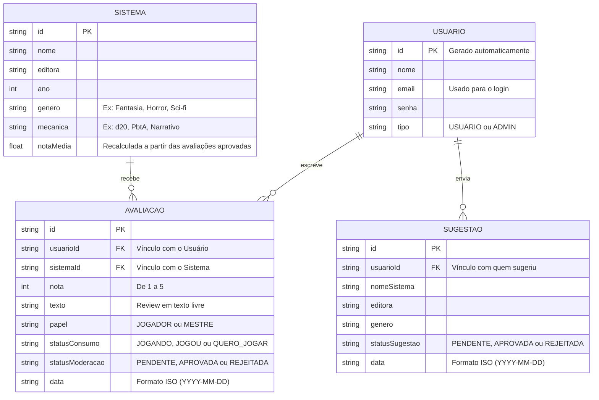

# 🛠️ Especificação Técnica (Architecture) - Inessa RPG Reviews

Este documento detalha o modelo de dados e os contratos de API (via JSON Server) necessários para o funcionamento do Inessa RPG Reviews.

## 1. Modelo de Dados (Diagrama ER)



## 2. Dicionário de Dados

- **Usuários:** armazena dados de autenticação e identificação do usuário.
  - id: identificador único gerado pelo JSON Server.
  - email: chave de acesso do usuário (login).
- **Sistemas:** catálogo de sistemas de RPG disponíveis para avaliação.
  - notaMedia: valor numérico (Float) recalculado no front-end a partir de todas as avaliações vinculadas ao sistema.
- **Avaliações:** registra a experiência de um usuário com um sistema. Regra de Negócio Crítica: toda avaliação nasce com `statusModeracao: "PENDENTE"`; apenas quando um Administrador aprova (`"APROVADA"`) ela conta para o recálculo, via JavaScript, da `notaMedia` do sistema e passa a aparecer publicamente.
  - usuarioId / sistemaId: chaves estrangeiras (padrão de nomenclatura exigido pelo JSON Server para rotas aninhadas).
  - papel: aceita apenas "JOGADOR" ou "MESTRE".
  - statusConsumo: aceita apenas "JOGANDO", "JOGOU" ou "QUERO_JOGAR".
  - statusModeracao: aceita apenas "PENDENTE", "APROVADA" ou "REJEITADA".
- **Sugestões:** registra pedidos de usuários para novos sistemas entrarem no catálogo. Regra de Negócio: cadastro de sistemas continua manual (feito pelo Administrador); a sugestão serve apenas como input — quando aprovada, o Administrador cria o registro correspondente em `sistemas`.
  - statusSugestao: aceita apenas "PENDENTE", "APROVADA" ou "REJEITADA".

## 3. Rotas da API (JSON Server)

- `GET /usuarios` - retorna a lista de usuários.
- `POST /usuarios` - cadastra um novo usuário.
- `GET /sistemas` - retorna o catálogo completo de sistemas de RPG.
- `GET /sistemas/:id` - retorna os dados de um sistema específico.
- `GET /avaliacoes?sistemaId=1` - retorna todas as avaliações de um sistema específico.
- `GET /avaliacoes?usuarioId=1` - retorna todas as avaliações feitas por um usuário (vitrine de perfil).
- `GET /avaliacoes?statusModeracao=PENDENTE` - retorna as avaliações aguardando moderação.
- `POST /avaliacoes` - cria uma nova avaliação (nasce como "PENDENTE").
- `PATCH /avaliacoes/:id` - atualiza o `statusModeracao` de uma avaliação (aprovar/rejeitar).
- `GET /sugestoes` - retorna as sugestões de sistemas enviadas pelos usuários.
- `POST /sugestoes` - cria uma nova sugestão de sistema.
- `PATCH /sugestoes/:id` - atualiza o `statusSugestao` de uma sugestão (aprovar/rejeitar).

## 4. Estrutura do Banco de Dados (db.json)

```JSON
{
    "usuarios": [
    {
        "id": "1",
        "nome": "Ana Mestra",
        "email": "ana@email.com",
        "senha": "senha_super_segura",
        "tipo": "USUARIO"
    },
    {
        "id": "2",
        "nome": "Admin Poço Penumbra",
        "email": "admin@inessarpgreviews.com",
        "senha": "senha_super_segura",
        "tipo": "ADMIN"
    }],
    "sistemas": [
    {
        "id": "1",
        "nome": "Ordem Paranormal",
        "editora": "Editora Omni",
        "ano": 2018,
        "genero": "Terror/Horror",
        "mecanica": "d20",
        "notaMedia": 4.5
    }],
    "avaliacoes": [
    {
        "id": "1",
        "usuarioId": "1",
        "sistemaId": "1",
        "nota": 5,
        "texto": "Ótima atmosfera de horror, recomendo mestrar.",
        "papel": "MESTRE",
        "statusConsumo": "JOGOU",
        "statusModeracao": "APROVADA",
        "data": "2026-03-16"
    }],
    "sugestoes": [
    {
        "id": "1",
        "usuarioId": "1",
        "nomeSistema": "Tormenta20",
        "editora": "Jambô Editora",
        "genero": "Fantasia",
        "statusSugestao": "PENDENTE",
        "data": "2026-03-16"
    }]
}
```
